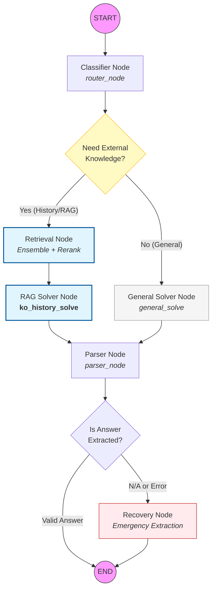

```mermaid
graph TD
    %% 1. 노드 정의
    Start((START))
    Classify[Classifier Node<br/><i>router_node</i>]
    Decision{Need External<br/>Knowledge?}
    
    Retrieve[Retrieval Node<br/><i>Ensemble + Rerank</i>]
    RAGSolve[RAG Solver Node<br/><b>ko_history_solve</b>]
    GeneralSolve[General Solver Node<br/><i>general_solve</i>]
    
    Parse[Parser Node<br/><i>parser_node</i>]
    Check{Is Answer<br/>Extracted?}
    Recovery[Recovery Node<br/><i>Emergency Extraction</i>]
    Finish((END))

    %% 2. 흐름 연결
    Start --> Classify
    Classify --> Decision

    %% RAG 경로 (검색 -> RAG 풀이)
    Decision -- "Yes (History/RAG)" --> Retrieve
    Retrieve --> RAGSolve
    RAGSolve --> Parse

    %% 일반 경로 (직접 풀이)
    Decision -- "No (General)" --> GeneralSolve
    GeneralSolve --> Parse

    %% 검증 및 복구
    Parse --> Check
    Check -- "Valid Answer" --> Finish
    Check -- "N/A or Error" --> Recovery
    
    Recovery --> Finish

    %% 3. 스타일링 (RAG 경로를 더 강조)
    style Start fill:#f9f,stroke:#333
    style Finish fill:#f9f,stroke:#333
    style Decision fill:#fff9c4,stroke:#fbc02d
    style Retrieve fill:#e1f5fe,stroke:#01579b,stroke-width:2px
    style RAGSolve fill:#e1f5fe,stroke:#01579b,stroke-width:2px
    style GeneralSolve fill:#f5f5f5,stroke:#9e9e9e
    style Recovery fill:#ffebee,stroke:#c62828
```